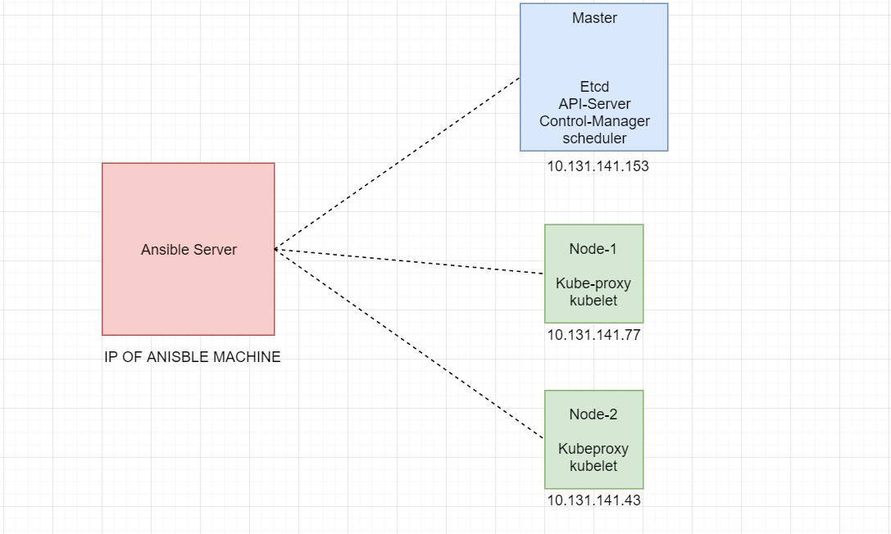

# Kubernetes cluster setup using ansible.

####  Follow below steps to setup single  Kubernet master node having n number of worker node.

**Step-1: Clone the git repo https://github.gwd.broadcom.net/kc030724/Kubernetcluster_using_ansible.git**

**Step -2 : Go to the Kubernetcluster_using_ansible directory**

**Step -3 : Modify the inventory file as per your required infrastructure.**

**Step -4 : Give executive permission to "kubernet_cluster_setup.sh" file .** Verify **env_variables** file once as all variable called from this file.

**Step-5 : Then execute "kubernet_cluster_setup.sh" scripts to setting up kubernet cluster include Dashboard , along with NFS, Jenkins agent, ELK node configured .**
  

------------

------------

------------

------------

#### If you want to add other customized  component  to your existing  Kubernet cluster then you can go through the steps given inside respective points below .    
  * NOTE: If infrastructure does not have DNS setup , to resove the IP againt Hostname it needs to add all the host entry inside /etc/hosts file across all the machines,
 For that run **# ansible-playbook update_host_on_each_node.yml** to add entry inside /etc/hosts file as per details given in inventory file. Otherwise you can skip to run this playbook and directly run above given script to setup kubernet cluster.
      
Below task will be performed by ansible as per above code:

  1. Disable selinux , firewall and swap on required hosts
  2. Configure Docker and kubernet repo 
  3. Install required package for Kubernet cluster .
  4. Initialize Master Node with node join token.
      ( Generate a backup file of node join token file (i.e join_token ) for later time use)
  5. If NFS host given in inventory file , it will start configure nfs and add entry in /etc/exports and exports the shares.
  6. If ELK host details given in inventory file , it will configire ELK and test the connection on respective port along with it shown  console output about http status.
  7. If Jenkins slave node details given it will configure Jenkins slave and install required MSSQL package also make password less ssh to NFS and DB server (If DB server details given in inventory file).
  5. Join workers node .
  6. Configure network for the cluster.
  7. Create a admin user and generate Admin token to access the cluster.
  8. It will deploy NFS RBAC and Template yamls along with Haproxy ingress yaml after cluster setup.
  9. It will install helm and initialize helm run tiller pod .
  10. Finally it will deploy Dashbaord and run the dashbaord service on Nodeport and share complete dashbaord URL along with admin token.
  
# Configure Specific version kubernet cluster.
  Below steps need to apply to install specific version Kubernet and Docker
  -> Open **env_variables** and add kubernet and docker version like for example given below then run the playbook it will install given version of Kubernetes Cluster.
  
Example: # cat **env_variables**  
kube_version: 1.14.0-0  
docker_version: 18.06.3.ce-3.el7  

  # Joining new worker into existing cluster .
  
  Below steps need to follow to join new workers into existing cluster.
  
  1. Update inventory file with respective new workers dns/IP address value and remove workers details which was present previously from [all] group as well as [slaves] group.
  2. Run **copy_sshkey_all_machine.sh** to setup new node password less authentication with Ansible master .
  3. Run **ansible-playbook kubernet_cluster_setup.yaml -t join_worker** to add workers into exisitng kubernet cluster.Here tag join_worker is used to join new worker.
  
 **Dependant DNS/IP address entry in inventory file:**
   - Kubernet Master node IP/DNS
 
# Joining NFS server alone into existing cluster .

Below steps need to follow to join new NFS server into existing cluster.

1. Update inventory file with new nfs server DNS/IP address along with master node , worker node , jenkins node , elk node details.
2. Run **copy_sshkey_all_machine.sh** to setup new node password less authentication with Ansible master .
3. Run **ansible-playbook kubernet_cluster_setup.yaml -t nfs_node** to add external NFS server into the cluster.

**Dependant DNS/IP address entry in inventory file:**
   - Kubernet Master node IP/DNS
   - Kubernet worker node IP/DNS
   - Jenkins Node IP/DNS
   - ELK node IP/DNS

# Joining ELK server alone into existing cluster .
Below steps need to follow to join new ELK server into existing cluster.

1. Update inventory file with new elk server DNS/IP address  details.
2. Run **copy_sshkey_all_machine.sh** to setup new node password less authentication with Ansible master .
3. Run **ansible-playbook kubernet_cluster_setup.yaml -t elk_node** to add external ELK server into the cluster.

**Dependant DNS/IP address entry in inventory file along with ELK Node details:**
   - NONE, ONLY ELK details enough.

# Joining Jenkins server alone into existing cluster .

Below steps need to follow to join new Jenkins server into the exisiting cluster .
1. Update inventory file with required jenkins DNS/IP address.If you want to do password less ssh connection then update NFS server and DB server details in the inventory file.
2. Run **copy_sshkey_all_machine.sh** to setup new node password less authentication with Ansible master .
3. Run **ansible-playbook kubernet_cluster_setup.yaml -t jenkins_node** to add external ELK server into the cluster.
 This will install all required packages along with MSSQL packages and configure password less ssh to NFS and DB server.
  
 **Dependant DNS/IP address entry in inventory file:**
   - Jenkins Node IP/DNS
   - NFS node IP/DNS
   - DB server IP/DNS
   # Deploy Dashboard and metrics server into exisiting cluster .
   
   Below steps need to follow to deploy Dashboard into the exisiting cluster .
   1. Update inventory file with required Master machine hostname/IP
   2. Run **copy_sshkey_all_machine.sh** to setup new node password less authentication with Ansible master .
   3. Run **ansible-playbook kubernet_cluster_setup.yaml -t kube_dashboard** to deploy dashboard along with Matrix server configuration . It will skip the yaml file if it already configured on the existing kubernet cluster.
